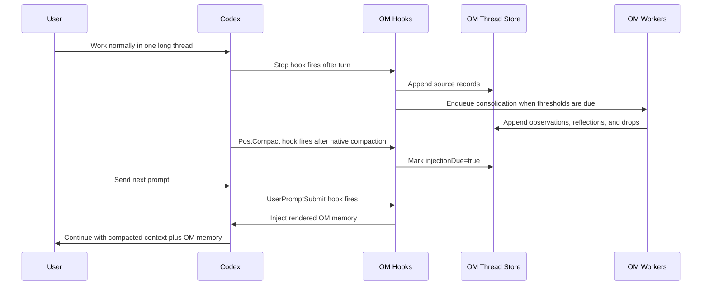
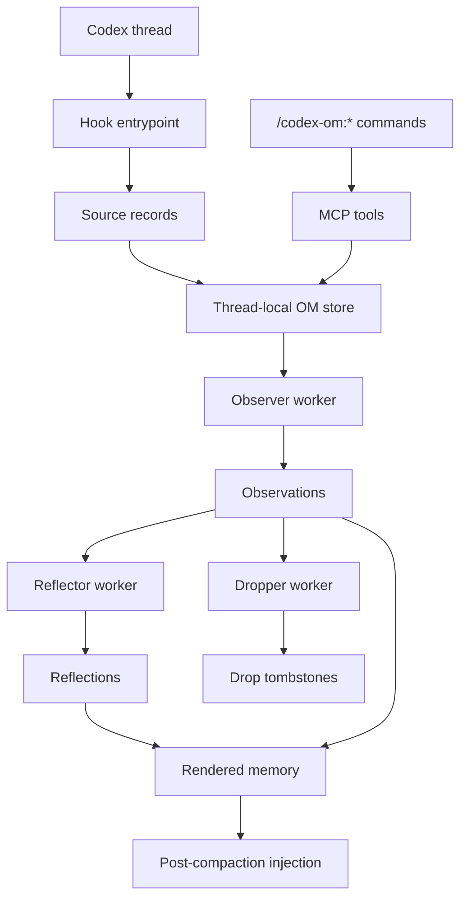

# codex-observational-memory

Source-backed observational memory for long Codex sessions.

`codex-observational-memory` is a Codex plugin for keeping one long-running Codex thread coherent across native compaction. It records source-backed observations while you work, distills durable reflections, and reinjects compact memory into the same thread after Codex compacts context.

It does not replace Codex compaction. It gives compaction a thread-local memory layer with recallable evidence.

```text
Codex compacted context
+
OM reflections
+
OM active observations
```

## Why This Exists

Long Codex sessions can span days or weeks. Native compaction keeps the thread alive, but repeated summaries can lose details that matter during engineering work:

- decisions the user already made
- exact file paths, commands, errors, and constraints
- completed work that should not be repeated
- rejected approaches and why they were rejected
- user corrections that must survive compaction

This plugin keeps a separate thread-local ledger under `CODEX_HOME`. After compaction, Codex receives a concise rendered memory block backed by records from the same thread.

## What It Does

- Captures source records from Codex hook events.
- Stores generated memory outside Codex session files.
- Runs worker passes that turn raw source into observations, reflections, and drops.
- Reinjects rendered memory after native Codex compaction.
- Adds `/codex-om:*` slash commands inside the Codex session.
- Exposes MCP tools used by the slash commands.

## What It Does Not Do

- It does not edit `~/.codex/sessions`.
- It does not replace Codex native compaction.
- It does not create global memory across projects or unrelated threads.
- It does not sync memory to a cloud service.
- It does not guarantee perfect memory. Worker output is model-generated, so use recall when exact evidence matters.

## Install

Install from the GitHub marketplace source:

```bash
codex plugin marketplace add sovorn-c/codex-observational-memory
codex plugin add codex-observational-memory --marketplace codex-observational-memory
```

Refresh updates from GitHub:

```bash
codex plugin marketplace upgrade codex-observational-memory
```

The npm package installs the same bundle for environments that prefer npm-managed files:

```bash
npm install -g codex-observational-memory
```

After Codex loads the plugin, start or resume a Codex thread and run:

```text
/codex-om:status
```

The plugin provides:

| Piece | Path | Purpose |
| --- | --- | --- |
| Marketplace | `.agents/plugins/marketplace.json` | Lets Codex install the plugin from this GitHub repo. |
| Plugin manifest | `.codex-plugin/plugin.json` | Registers skills and MCP. |
| Slash commands | `commands/` | Bundles `/codex-om:*` command prompts. |
| Hooks | `hooks/hooks.json` | Captures source records and handles post-compaction injection. |
| MCP server | `dist/mcp/server.js` | Serves memory tools used by commands and Codex. |
| Skill | `skills/codex-observational-memory/SKILL.md` | Teaches Codex how to interpret and use OM memory. |

## Recommended Codex Setting

For long-running sessions, use a high native compaction limit appropriate for your model:

```toml
# ~/.codex/config.toml
model_auto_compact_token_limit = 160000
```

OM works with Codex native compaction. A higher limit gives Codex more live context before OM has to help reconstruct long-range state.

## Quick Start

1. Add the GitHub marketplace source to Codex.
2. Install the plugin from that marketplace.
3. Start one long Codex thread for the work.
4. Work normally.
5. OM hooks capture source records after turns.
6. OM workers consolidate those records after token thresholds are crossed.
7. When Codex compacts, OM marks memory injection as due.
8. On the next prompt, OM injects source-backed thread memory.

Use these commands inside Codex when you need to inspect or control memory:

```text
/codex-om:status
/codex-om:view
/codex-om:view full
/codex-om:recall abc123def456
/codex-om:consolidate
```

## Slash Commands

| Command | Purpose |
| --- | --- |
| `/codex-om:status` | Show memory counts, active state, and consolidation progress. |
| `/codex-om:view` | Show currently active rendered memory. |
| `/codex-om:view full` | Show full recorded memory, including dropped observations. |
| `/codex-om:recall <id>` | Recall source evidence for a 12-character observation or reflection id. |
| `/codex-om:consolidate` | Run all eligible worker passes. |
| `/codex-om:consolidate observe` | Run observer only. |
| `/codex-om:consolidate reflect` | Run reflector only. |
| `/codex-om:consolidate drop` | Run dropper only. |

Normal continuity is automatic. The slash commands are for inspection, recall, and manual maintenance.

## MCP Tools

The slash commands are backed by MCP tools:

| Tool | Arguments | Purpose |
| --- | --- | --- |
| `om_status` | `{ threadId? }` | Show thread memory status. |
| `om_view` | `{ threadId?, full? }` | Render active or full memory. |
| `om_recall` | `{ threadId?, id }` | Return source evidence for a memory id. |
| `om_consolidate` | `{ threadId?, mode? }` | Run worker consolidation. |

## Typical Flow



## Architecture



## Storage Model

Generated state lives under:

```text
$CODEX_HOME/observational-memory/
  config.json
  debug/hooks.ndjson
  threads/<thread-id>/ledger.jsonl
  threads/<thread-id>/sources.jsonl
  threads/<thread-id>/state.json
  sessions/<session-id>/index.json
```

Default `CODEX_HOME`:

```text
~/.codex
```

Memory is scoped to one Codex thread:

- `threads/<thread-id>/sources.jsonl` stores captured source records.
- `threads/<thread-id>/ledger.jsonl` stores observations, reflections, drops, compaction markers, injection markers, and worker errors.
- `threads/<thread-id>/state.json` stores small state such as `injectionDue`.
- `sessions/<session-id>/index.json` maps a session id back to a thread id.

## Ledger Records

| Record type | Purpose |
| --- | --- |
| `om.source.recorded` | Source entries were captured. |
| `om.observations.recorded` | Observer emitted observations. |
| `om.reflections.recorded` | Reflector emitted durable reflections. |
| `om.observations.dropped` | Dropper tombstoned observations from active memory. |
| `om.compaction` | Codex native compaction happened. |
| `om.injected` | OM memory was injected into the thread. |
| `om.worker.error` | A worker failed and recorded an actionable error. |

Observations and reflections use first-valid-record-wins semantics. Drops are tombstones: they remove observations from active rendered memory, but recall can still find source evidence.

## Configuration

Configuration precedence:

```text
environment variables
>
$CODEX_HOME/observational-memory/config.json
>
built-in defaults
```

Default config path:

```text
~/.codex/observational-memory/config.json
```

Example config:

```json
{
  "llm": {
    "provider": "codex",
    "model": "gpt-5.4-mini",
    "apiKey": "",
    "baseUrl": ""
  },
  "memory": {
    "observeAfterTokens": 10000,
    "reflectAfterTokens": 20000,
    "observationsPoolMaxTokens": 20000,
    "observationsPoolTargetTokens": 10000
  },
  "debug": false
}
```

### Config File Fields

| Field | Default | Description |
| --- | --- | --- |
| `llm.provider` | `codex` | Worker provider. Supported: `codex`, `openrouter`, `opencode-go`, `openai`, `gemini`. |
| `llm.model` | `gpt-5.4-mini` | Model used for observer, reflector, and dropper workers. |
| `llm.apiKey` | `""` | Optional plaintext API key for external providers. Prefer env vars for secrets. |
| `llm.baseUrl` | `""` | Optional provider endpoint override. |
| `memory.observeAfterTokens` | `10000` | Run observer after this many raw source tokens since observation coverage. |
| `memory.reflectAfterTokens` | `20000` | Run reflector after this many raw source tokens since reflection coverage. |
| `memory.observationsPoolMaxTokens` | `20000` | Maximum visible observation pool pressure used by memory rendering policy. |
| `memory.observationsPoolTargetTokens` | `10000` | Dropper target for active observation tokens. |
| `debug` | `false` | Enables debug hook logging. |

### Environment Variables

| Variable | Default | Description |
| --- | --- | --- |
| `CODEX_HOME` | `~/.codex` | Base Codex directory. OM state is stored below this path. |
| `OM_LLM_PROVIDER` | `codex` | Worker provider. `deepseek` is an alias for OpenRouter when no base URL is set. |
| `OM_LLM_MODEL` | `gpt-5.4-mini` | Worker model override. |
| `OM_LLM_API_KEY` | empty | API key for external providers. |
| `OM_LLM_BASE_URL` | empty | Provider endpoint override. |
| `OM_OBSERVE_AFTER_TOKENS` | `10000` | Observer threshold override. |
| `OM_REFLECT_AFTER_TOKENS` | `20000` | Reflector threshold override. |
| `OM_OBSERVATIONS_POOL_MAX_TOKENS` | `20000` | Observation pool max override. |
| `OM_OBSERVATIONS_POOL_TARGET_TOKENS` | `10000` | Observation pool target override. |
| `OM_DEBUG` | `0` | Enable debug logging with `1`, `true`, `yes`, or `on`. |
| `CODEX_OBSERVATIONAL_MEMORY_WORKER` | unset | Recursion guard. When `1`, hooks exit without memory work. |

## Worker Providers

| Provider | Default model | API key needed | Notes |
| --- | --- | --- | --- |
| `codex` | `gpt-5.4-mini` | No external key | Uses local `codex exec --ephemeral --ignore-rules`. |
| `openrouter` | `deepseek/deepseek-v4-flash` | Yes | OpenAI-compatible chat completions. |
| `opencode-go` | `deepseek-v4-flash` | Yes | OpenAI-compatible OpenCode Go endpoint. |
| `openai` | `gpt-5.4-nano` | Yes | External OpenAI API worker option. |
| `gemini` | `gemini-3.1-flash-lite` | Yes | Gemini generate-content API, JSON parsed from response text. |

## Rendered Memory Format

Example injected memory:

```md
These are source-backed observational memories for this Codex thread.

- Reflections are durable facts distilled from prior observations.
- Observations are timestamped records from earlier thread history.
- Use om_recall(id) when exact source evidence matters.
- If Codex compacted summary conflicts with OM, prefer the newest source-backed observation unless the user says otherwise.

## Reflections
[abc123def456] User chose GraphQL over REST for the public API because mobile clients were over-fetching.

## Observations
[def456abc123] 2026-07-08 14:30 [high] completed: implemented GraphQL schema migration and verified existing tests pass.
```

Use `/codex-om:recall def456abc123` when exact source evidence matters.

## Security Notes

- `config.json` is plaintext local config.
- Prefer environment variables for API keys on shared machines or automation.
- Source records may contain user prompts, assistant output, file paths, command output, errors, and project details.
- OM files are local generated state and should not be committed.
- The plugin deliberately avoids writing to `~/.codex/sessions`.

## Limitations

| Limitation | Impact |
| --- | --- |
| Thread-scoped only | Memory is not shared globally across projects or unrelated threads. |
| Hook payload variance | Source capture depends on Codex hook payload shapes. If capture looks wrong, enable `OM_DEBUG=1` and inspect `debug/hooks.ndjson`. |
| Model-generated memory | Observations and reflections can be incomplete or wrong. Use recall for important decisions. |
| Recall is id-based | Recall requires a specific 12-character observation or reflection id. |
| Background cost | Worker calls consume model/API tokens. Thresholds batch work to reduce overhead. |
| Local state only | State is stored under `$CODEX_HOME/observational-memory` and is not cloud-synced by this plugin. |
| External providers need keys | OpenRouter, OpenCode Go, OpenAI, and Gemini require configured API keys. |

## Repository Layout

```text
codex-observational-memory/
|-- .codex-plugin/plugin.json
|-- commands/
|   |-- codex-om:status.md
|   |-- codex-om:view.md
|   |-- codex-om:recall.md
|   `-- codex-om:consolidate.md
|-- hooks/hooks.json
|-- skills/codex-observational-memory/SKILL.md
|-- src/
|   |-- cli.ts
|   |-- config.ts
|   |-- storage.ts
|   |-- hooks/entry.ts
|   |-- ledger/
|   |-- mcp/server.ts
|   |-- providers/
|   `-- workers/
`-- test/
```

## License

MIT
